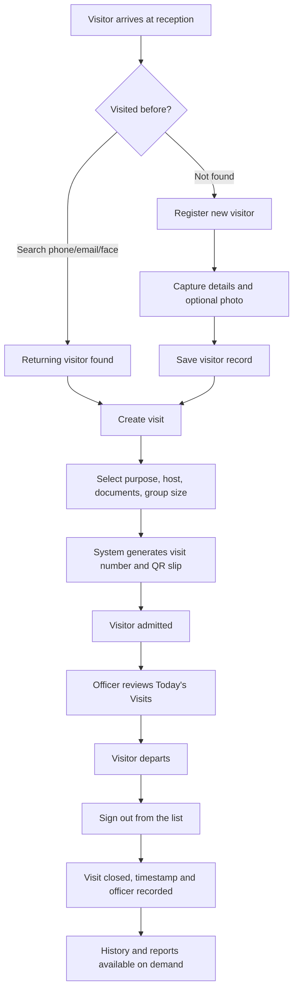

# NCS Visitor Management System
# Business Requirements Specification (BRS)

| | |
| --- | --- |
| **Document title** | Business Requirements Specification — NCS Visitor Management System |
| **Version** | 1.0 |
| **Status** | Approved for prototype delivery |
| **Date** | 22 September 2026 |
| **Author** | Yange Henry Terzugwe |
| **Prepared for** | NCS Management and Reception Operations |

---

## Document Control

### Revision history

| Version | Date | Author | Changes |
| --- | --- | --- | --- |
| 0.1 | 20 Sep 2026 | Y. H. Terzugwe | Initial draft |
| 1.0 | 22 Sep 2026 | Y. H. Terzugwe | Approved scope; added roles and reporting requirements |

### Distribution

| Recipient | Purpose |
| --- | --- |
| Management | Approval and prioritisation |
| Reception / Security | Operational requirements validation |
| Development team | Implementation reference |
| IT Operations | Deployment and hosting planning |

---

## Table of Contents

1. [Executive Summary](#1-executive-summary)
2. [Business Context](#2-business-context)
3. [Business Objectives](#3-business-objectives)
4. [Scope](#4-scope)
5. [Stakeholders](#5-stakeholders)
6. [Business Process — Current vs Proposed](#6-business-process--current-vs-proposed)
7. [Functional Requirements](#7-functional-requirements)
8. [Non-Functional Requirements](#8-non-functional-requirements)
9. [Data Requirements](#9-data-requirements)
10. [User Roles and Permissions Matrix](#10-user-roles-and-permissions-matrix)
11. [Reporting Requirements](#11-reporting-requirements)
12. [Security, Privacy and Compliance](#12-security-privacy-and-compliance)
13. [Assumptions and Constraints](#13-assumptions-and-constraints)
14. [Acceptance Criteria](#14-acceptance-criteria)
15. [Risks and Mitigations](#15-risks-and-mitigations)
16. [Implementation Approach](#16-implementation-approach)
17. [Future Enhancements](#17-future-enhancements)
18. [Glossary](#18-glossary)
19. [Approval](#19-approval)

---

## 1. Executive Summary

The NCS Visitor Management System (VMS) replaces paper visitor registers with a
digital workflow for registering visitors, tracking their entry and exit, and
reporting on visitor activity.

The current paper-based process limits the organisation's ability to answer
fundamental security questions: who entered a facility, when, for what purpose, and
whether they have left. Records are decentralised, illegible, unsearchable and
cannot be aggregated without significant manual effort.

This specification defines the business requirements for a system that provides
**a single, searchable, auditable record of all visitor activity**, with
role-appropriate access for reception officers and administrators.

A working prototype has been delivered. This document defines the requirements it
satisfies, the criteria for acceptance, and the work required to move it into
production.

---

## 2. Business Context

### 2.1 Business problem

Reception desks currently record visitors in paper registers. This creates:

| Problem | Business impact |
| --- | --- |
| Illegible and inconsistent handwriting | Records cannot be reliably read or verified |
| Decentralised books per desk | No consolidated view across facilities |
| No search capability | Returning visitors cannot be identified; records re-created |
| Manual reference numbering | Lost, duplicated or missing references |
| No real-time occupancy view | Security cannot confirm who is currently on site |
| Manual counting for reports | Reporting is slow, error-prone and often skipped |
| No access control on records | Any person at the desk can read any record |
| No audit trail | Actions cannot be attributed to an individual |

### 2.2 Business drivers

1. **Security assurance** — demonstrate control over who accesses NCS facilities.
2. **Operational efficiency** — reduce time spent on manual registration and reporting.
3. **Accountability** — attribute every visitor decision to a named officer.
4. **Management visibility** — produce visitor statistics on demand.
5. **Data protection readiness** — handle personal data responsibly and defensibly.

### 2.3 Current state summary

| Aspect | Current (paper) | Required (digital) |
| --- | --- | --- |
| Registration | Handwritten book | Structured electronic record |
| Lookup | Manual page turning | Instant search |
| Identification | Officer memory | Photo record and history |
| References | Manual | System-generated and unique |
| Occupancy | Unknown | Real-time |
| Reporting | Manual counting | On-demand, exportable |
| Access control | None | Role-based |
| Audit | None | Named and timestamped |

---

## 3. Business Objectives

| ID | Objective | Success measure |
| --- | --- | --- |
| **BO-1** | Digitise visitor registration | 100% of visitors recorded electronically |
| **BO-2** | Enable instant visitor lookup | Returning visitor identified in under 5 seconds |
| **BO-3** | Provide real-time occupancy | Current on-site visitor count available at any time |
| **BO-4** | Ensure accountability | Every visit attributes to a named officer |
| **BO-5** | Automate reporting | Any date-range report produced in under 1 minute |
| **BO-6** | Enforce access control | Officers and administrators see only their module |
| **BO-7** | Improve data quality | No duplicate visitor records for the same phone number |
| **BO-8** | Reduce registration time | Average check-in under 60 seconds for a returning visitor |

---

## 4. Scope

### 4.1 In scope

**Visitor management**
- Registration and maintenance of visitor records
- Capture of contact, identity and organisational details
- Optional visitor photograph with standardised processing
- Identification of returning visitors

**Visit management**
- Creation of visits with purpose, host, destination and group size
- Automatic generation of unique visit references
- QR-coded visitor slips
- Sign-in and sign-out tracking
- Prevention of duplicate open visits

**Records and reporting**
- Today's visits view with live search
- Historical visit search with multi-criteria filtering
- CSV export of results
- Summary statistics dashboard

**Administration**
- User account management
- Role definition and assignment
- Organisational location management
- Administrator reporting access

**Access control**
- Database-backed authentication
- Role-based module routing and access enforcement
- Account enable/disable

### 4.2 Out of scope (this phase)

- Physical access control integration (turnstiles, door controllers)
- Badge or card printing
- Visitor pre-registration or self-service kiosks
- SMS/email visitor notifications
- Biometric fingerprint or voice capture
- Mobile applications
- Multi-tenant or multi-organisation support
- Payroll, HR or procurement integration

### 4.3 Deferred to future phases

- Badge printing and gate-side QR scanning
- Automated host notification on arrival
- Cloud hosting with automated backup and disaster recovery
- Offline-capable operation

---

## 5. Stakeholders

| Stakeholder | Role | Interest | Influence |
| --- | --- | --- | --- |
| **Management** | Sponsor and approver | Security assurance, reporting, ROI | High |
| **Head of Security** | Process owner | Site control, occupancy visibility, audit | High |
| **Reception Officers** | Primary users | Fast, simple check-in; minimal typing | High |
| **System Administrator** | System owner | User management, data integrity, continuity | High |
| **IT Operations** | Technical support | Deployment, backups, availability | Medium |
| **Visitors** | External parties | Quick, professional, respectful entry | Low |
| **Data Protection Officer** | Compliance | Lawful handling of personal data | Medium |
| **Auditors** | Assurance | Complete, attributable records | Medium |

### 5.1 User personas

**Reception Officer — "Mary"**
Handles 40–80 visitors a day at a busy desk. Needs to register visitors quickly
without hunting for information. Is not technical. Works on a shared desk computer.
*Needs:* speed, minimal typing, clear feedback, the ability to find a returning
visitor instantly.

**System Administrator — "David"**
Manages accounts and reporting. Is accountable if access controls fail.
*Needs:* a clear view of who can access what, safe user administration, reliable
reports, protection against accidental lockout.

**Head of Security — "Colonel A"**
Requires assurance that the facility is controlled and that records exist for any
given date.
*Needs:* live occupancy, complete history, exportable evidence, attributable actions.

---

## 6. Business Process — Current vs Proposed

### 6.1 Current process (paper)

```text
Visitor arrives
   → Officer opens the register book
   → Officer asks for details and writes them down
   → Officer assigns a number by hand
   → Visitor is admitted
   → On departure, officer finds the row and writes the time
   → Periodically, someone counts entries for reports
```

**Weaknesses:** illegible, unsearchable, no occupancy view, no accountability,
reporting is manual and unreliable.

### 6.2 Proposed process (digital)



**Improvements:** structured data, instant lookup, real-time occupancy, named
accountability, on-demand reporting.

### 6.3 Process rules

| Rule | Description |
| --- | --- |
| **BR-1** | A visitor may hold only one active visit per day |
| **BR-2** | A visitor is uniquely identified by phone number |
| **BR-3** | Every visit must have a unique reference number |
| **BR-4** | A personal visit must record the host or officer being visited |
| **BR-5** | A visitor cannot be signed out twice |
| **BR-6** | Every visit records the officer who created it |
| **BR-7** | Every sign-out records the officer who performed it |

---

## 7. Functional Requirements

Priority: **M** = Must have, **S** = Should have, **C** = Could have.

### 7.1 Authentication and access

| ID | Requirement | Priority |
| --- | --- | --- |
| FR-1.1 | The system shall authenticate users against stored accounts using a service number and password | M |
| FR-1.2 | The system shall store passwords only as salted hashes | M |
| FR-1.3 | The system shall reject authentication for disabled accounts | M |
| FR-1.4 | The system shall redirect users to the module appropriate to their role after login | M |
| FR-1.5 | The system shall prevent access to the admin module by non-admin users | M |
| FR-1.6 | The system shall provide a logout function that clears the session | M |
| FR-1.7 | The system shall prevent administrators from disabling, deleting or demoting their own account | M |
| FR-1.8 | The system shall record the date and time of a user's last login | S |

### 7.2 Visitor registration

| ID | Requirement | Priority |
| --- | --- | --- |
| FR-2.1 | The system shall register a visitor with a full name and phone number | M |
| FR-2.2 | The system shall capture optional email, address and gender | M |
| FR-2.3 | The system shall capture optional organisation, ID type and ID number | S |
| FR-2.4 | The system shall normalise visitor names to uppercase | M |
| FR-2.5 | The system shall accept phone numbers of exactly 11 digits and reject other formats | M |
| FR-2.6 | The system shall prevent duplicate visitor records sharing a phone number | M |
| FR-2.7 | The system shall detect an existing visitor by email as a secondary check | S |
| FR-2.8 | The system shall capture an optional visitor photograph | M |
| FR-2.9 | The system shall standardise photographs onto a white background | S |
| FR-2.10 | The system shall record which officer created each visitor record | S |

### 7.3 Visitor identification

| ID | Requirement | Priority |
| --- | --- | --- |
| FR-3.1 | The system shall locate a visitor by phone number or email | M |
| FR-3.2 | The system shall display a found visitor's details and previous visit count | M |
| FR-3.3 | The system shall offer photographic identification of returning visitors | C |
| FR-3.4 | The system shall allow a visitor's details to be amended | S |
| FR-3.5 | The system shall allow an officer to proceed without photographic identification | M |

### 7.4 Visit management

| ID | Requirement | Priority |
| --- | --- | --- |
| FR-4.1 | The system shall create a visit linked to a registered visitor | M |
| FR-4.2 | The system shall record the purpose as official or personal | M |
| FR-4.3 | The system shall require a host for personal visits | M |
| FR-4.4 | The system shall record destination, documents carried and group size | S |
| FR-4.5 | The system shall generate a unique visit reference number | M |
| FR-4.6 | The system shall generate a QR code for each visit | S |
| FR-4.7 | The system shall refuse a second active visit for the same visitor on the same day | M |
| FR-4.8 | The system shall explain clearly why a duplicate visit was refused | M |

### 7.5 Sign-in and sign-out

| ID | Requirement | Priority |
| --- | --- | --- |
| FR-5.1 | The system shall record every visit as signed in on creation | M |
| FR-5.2 | The system shall allow a visitor to be signed out by reference number | M |
| FR-5.3 | The system shall allow a visitor to be signed out directly from the daily list | M |
| FR-5.4 | The system shall record the sign-out time and the officer responsible | M |
| FR-5.5 | The system shall display current status as in or out | M |
| FR-5.6 | The system shall prevent signing out an already-closed visit | M |

### 7.6 Daily operations

| ID | Requirement | Priority |
| --- | --- | --- |
| FR-6.1 | The system shall list all visits for the current day | M |
| FR-6.2 | The system shall filter the daily list by visitor name or phone | M |
| FR-6.3 | The system shall show a count of visits for the day | S |
| FR-6.4 | The system shall distinguish active from completed visits visually | S |

### 7.7 History and reporting

| ID | Requirement | Priority |
| --- | --- | --- |
| FR-7.1 | The system shall provide access to all historical visits | M |
| FR-7.2 | The system shall filter history by free text across name, phone, reference, host and destination | M |
| FR-7.3 | The system shall filter by status | M |
| FR-7.4 | The system shall filter by purpose | S |
| FR-7.5 | The system shall filter by month and year | M |
| FR-7.6 | The system shall filter by a date range | M |
| FR-7.7 | The system shall combine multiple filters simultaneously | M |
| FR-7.8 | The system shall display summary counts for the filtered set | S |
| FR-7.9 | The system shall export filtered results to CSV | M |
| FR-7.10 | The system shall tolerate invalid filter input without error | S |

### 7.8 Department verification

| ID | Requirement | Priority |
| --- | --- | --- |
| FR-8.12 | The system shall provide a camera-only verification screen for department staff | M |
| FR-8.13 | The verification screen shall confirm whether a person is a registered visitor | M |
| FR-8.14 | The verification screen shall report whether the visitor is currently signed in | M |
| FR-8.15 | The verification screen shall distinguish "on site", "not signed in" and "not verified" | M |
| FR-8.16 | The verification screen shall operate automatically as a person passes the camera | S |
| FR-8.17 | The verification screen shall allow a manual check on demand | M |
| FR-8.18 | The verification screen shall not display visitor contact details, addresses, ID numbers or visit history | M |
| FR-8.19 | Department staff shall not be able to browse visitor records or visit history | M |
| FR-8.20 | The verification screen shall warn when more than one face is detected | S |

### 7.9 Administration

| ID | Requirement | Priority |
| --- | --- | --- |
| FR-8.1 | The system shall allow administrators to create user accounts | M |
| FR-8.2 | The system shall allow administrators to edit user details and reset passwords | M |
| FR-8.3 | The system shall allow administrators to enable and disable accounts | M |
| FR-8.4 | The system shall allow administrators to delete accounts | S |
| FR-8.5 | The system shall require passwords of at least six characters | S |
| FR-8.6 | The system shall allow administrators to define roles | M |
| FR-8.7 | The system shall allow each role to specify its landing module | M |
| FR-8.8 | The system shall protect built-in roles from deletion | S |
| FR-8.9 | The system shall prevent deletion of a role assigned to users | S |
| FR-8.10 | The system shall allow administrators to manage departments, commands and units | S |
| FR-8.11 | The system shall present a dashboard of key statistics | S |

---

## 8. Non-Functional Requirements

### 8.1 Performance

| ID | Requirement | Target |
| --- | --- | --- |
| NFR-1.1 | Page response time under normal load | < 2 seconds |
| NFR-1.2 | Visitor search response | < 1 second |
| NFR-1.3 | Visit creation including QR generation | < 3 seconds |
| NFR-1.4 | Return a filtered history query | < 3 seconds for typical volumes |
| NFR-1.5 | Support concurrent reception desks | Minimum 5 (see constraints) |

### 8.2 Usability

| ID | Requirement |
| --- | --- |
| NFR-2.1 | A new officer shall complete registration without training beyond the User Guide |
| NFR-2.2 | The interface shall use clear, plain language |
| NFR-2.3 | The system shall give immediate feedback on every action |
| NFR-2.4 | Errors shall explain the problem and the corrective action |
| NFR-2.5 | The interface shall be usable on desktop and tablet screens |
| NFR-2.6 | Colour shall not be the sole indicator of status |

### 8.3 Reliability and availability

| ID | Requirement |
| --- | --- |
| NFR-3.1 | The system shall not lose a committed visit record |
| NFR-3.2 | The system shall degrade gracefully when a peripheral such as a camera is unavailable |
| NFR-3.3 | Data shall be recoverable from backup in the event of failure |
| NFR-3.4 | The system shall target 99% availability during reception hours (production) |

### 8.4 Security

| ID | Requirement |
| --- | --- |
| NFR-4.1 | All access shall require authentication |
| NFR-4.2 | Access shall be restricted according to role |
| NFR-4.3 | Passwords shall never be stored or transmitted in plain text |
| NFR-4.4 | All state-changing requests shall be protected against CSRF |
| NFR-4.5 | The system shall resist brute-force login attempts |
| NFR-4.6 | Production traffic shall be encrypted with TLS |
| NFR-4.7 | Personal data shall be protected at rest |

### 8.5 Maintainability

| ID | Requirement |
| --- | --- |
| NFR-5.1 | The codebase shall be documented for new developers |
| NFR-5.2 | Adding a database column shall follow a documented, repeatable process |
| NFR-5.3 | Roles and their permissions shall be configurable without code changes |
| NFR-5.4 | The system shall include automated tests before production rollout |

### 8.6 Compatibility

| ID | Requirement |
| --- | --- |
| NFR-6.1 | Support current versions of Chrome, Edge and Firefox |
| NFR-6.2 | Require no browser plug-ins |
| NFR-6.3 | Function without internet access on the local network |

---

## 9. Data Requirements

### 9.1 Core entities

| Entity | Description | Retention |
| --- | --- | --- |
| **Visitor** | A person who visits NCS facilities | Per retention policy (TBD) |
| **Visit** | A single entry event by a visitor | Per retention policy (TBD) |
| **User** | A staff member who operates the system | Life of employment plus audit period |
| **Role** | The permission level assigned to users | Indefinite |
| **Location** | Department, command or unit | Indefinite |

### 9.2 Visitor data captured

| Field | Required | Personal data |
| --- | --- | --- |
| Full name | Yes | Yes |
| Phone number | Yes | Yes |
| Email address | No | Yes |
| Physical address | No | Yes |
| Organisation | No | No |
| ID type and number | No | Yes |
| Gender | No | Yes |
| Photograph | No | Yes — sensitive |

### 9.3 Visit data captured

Visit reference, date, purpose, host, destination, documents carried, group size,
status, sign-in time, sign-out time, creating officer, signing-out officer.

### 9.4 Data quality rules

| Rule | Rationale |
| --- | --- |
| Phone must be exactly 11 digits | Reliable unique identification |
| Names stored uppercase | Consistent presentation and matching |
| Phone unique per visitor | Duplicate prevention |
| Visit reference unique | Reliable audit referencing |
| Email matched case-insensitively | Avoids near-duplicate records |

### 9.5 Data migration

No historic paper records are to be migrated in this phase. Historical data may be
added later if required.

---

## 10. User Roles and Permissions Matrix

| Capability | Officer | Department | Admin |
| --- | --- | --- | --- |
| Sign in | ✅ | ✅ | ✅ |
| Register a visitor | ✅ | ❌ | ✅ |
| Search for a visitor | ✅ | ❌ | ✅ |
| Capture a photograph | ✅ | ❌ | ✅ |
| Create a visit | ✅ | ❌ | ✅ |
| Sign a visitor out | ✅ | ❌ | ✅ |
| View today's visits | ✅ | ❌ | ✅ |
| View visit history | ✅ | ❌ | ✅ |
| Export visit history | ✅ | ❌ | ✅ |
| **Verify a visitor by camera** | ✅ | ✅ | ✅ |
| View the admin dashboard | ❌ | ❌ | ✅ |
| Create / edit users | ❌ | ❌ | ✅ |
| Enable / disable users | ❌ | ❌ | ✅ |
| Delete users | ❌ | ❌ | ✅ |
| Create / edit roles | ❌ | ❌ | ✅ |
| Manage locations | ❌ | ❌ | ✅ |
| Access admin reports | ❌ | ❌ | ✅ |

### 10.1 Role principles

- **Least privilege** — officers receive only what reception requires; department
  staff receive only the verification screen and no access to visitor records.
- **Configurable roles** — additional roles may be created and pointed at the
  appropriate module without code changes.
- **Separation of duties** — administration, reception and department verification
  are distinct.
- **Data minimisation** — the department screen shows status and a name only, not
  the full visitor record.
- **Lockout protection** — an administrator cannot remove their own access.

---

## 11. Reporting Requirements

| ID | Report | Filters | Output |
| --- | --- | --- | --- |
| REP-1 | Today's visits | Name, phone | On screen |
| REP-2 | Visit history | Text, status, purpose, month, year, dates | On screen, CSV |
| REP-3 | Visit report | As above | On screen, CSV |
| REP-4 | Dashboard statistics | — | On screen |

### 11.1 Reporting questions the system must answer

- How many visitors entered today, this week, this month?
- How many official versus personal visits were recorded?
- Who is currently on site?
- Who visited on a specific date, and at what time?
- Which departments receive the most visitors?
- Who signed a particular visitor in or out?
- How long do visitors typically stay?

### 11.2 Reporting output requirements

- Results must be exportable to a format openable in Excel or Google Sheets.
- Exports must respect the filters currently applied.
- Counts must be shown for the filtered set.

---

## 12. Security, Privacy and Compliance

### 12.1 Security requirements summary

| Area | Requirement |
| --- | --- |
| Authentication | Individual accounts; no shared credentials |
| Password storage | Salted cryptographic hashing |
| Authorisation | Role-based, enforced server-side |
| Session management | Signed cookies; cleared on logout |
| CSRF protection | Required for all state-changing requests |
| Transport security | TLS in production |
| Audit | Actions attributable to named officers |
| Backups | Regular, tested, stored securely |

### 12.2 Privacy considerations

Visitor information and photographs are **personal data**. The following controls
apply:

| Control | Requirement |
| --- | --- |
| Collection | Collect only what is necessary for security purposes |
| Purpose limitation | Use data only for visitor management |
| Storage | Exclude personal data from source control |
| Access | Restrict to authenticated, authorised staff |
| Retention | Define and enforce a retention period |
| Deletion | Support removal on request and on expiry |
| Photographs | Treat as sensitive; encrypt at rest in production |
| Transparency | Inform visitors what is recorded and why |

### 12.3 Current compliance status

| Control | Status |
| --- | --- |
| Access control | Implemented |
| Password hashing | Implemented |
| Personal data excluded from source control | Implemented |
| CSRF protection | **Outstanding** |
| Encryption at rest | **Outstanding** |
| Retention policy | **Outstanding** |
| Audit logging | **Partially implemented** (visit level) |
| Backup and recovery | **Outstanding** |

> **Recommendation:** A formal retention policy and data protection impact
> assessment should be completed before production deployment.

---

## 13. Assumptions and Constraints

### 13.1 Assumptions

| ID | Assumption |
| --- | --- |
| A-1 | Reception desks have a networked computer with a modern browser |
| A-2 | A webcam is available where photographic identification is used |
| A-3 | Officers have been issued service numbers by the administrator |
| A-4 | The organisation can supply the department and command structure |
| A-5 | Visitors present a phone number that can be used as an identifier |
| A-6 | Internet access is available for initial setup and dependency installation |

### 13.2 Constraints

| ID | Constraint | Impact |
| --- | --- | --- |
| C-1 | SQLite is the current database | Concurrent writes are limited; not suitable for many desks |
| C-2 | Single-file Flask application | Maintainability degrades as features grow |
| C-3 | No automated test suite | Regression risk on change |
| C-4 | No CSRF protection | Security gap until addressed |
| C-5 | Browser camera APIs vary | Face check is a convenience, not guaranteed |
| C-6 | Photographic matching is heuristic | Not reliable as a sole identification method |
| C-7 | Prototype status | Not hardened for production use |

### 13.3 Dependencies

| Dependency | Owner |
| --- | --- |
| Hosting environment | IT Operations |
| Server provision and TLS certificates | IT Operations |
| Department and command structure data | Organisation |
| User account details and service numbers | System Administrator |
| Data protection policy | Data Protection Officer |

---

## 14. Acceptance Criteria

### 14.1 Functional acceptance

| # | Criterion | Verified |
| --- | --- | --- |
| AC-1 | An officer with valid credentials is routed to the reception module | ✅ |
| AC-2 | An administrator with valid credentials is routed to the admin dashboard | ✅ |
| AC-3 | An officer cannot access any admin page or admin API | ✅ |
| AC-4 | A disabled account cannot sign in | ✅ |
| AC-5 | An administrator cannot disable, delete or demote themselves | ✅ |
| AC-6 | A visitor can be registered with name and an 11-digit phone number | ✅ |
| AC-7 | Phone numbers of other lengths are rejected with a clear message | ✅ |
| AC-8 | Visitor names are stored uppercase | ✅ |
| AC-9 | Duplicate visitors by phone are prevented and the existing record shown | ✅ |
| AC-10 | A visitor photograph can be captured and processed | ✅ |
| AC-11 | A returning visitor can be found by phone or email | ✅ |
| AC-12 | A visit can be created with a unique reference | ✅ |
| AC-13 | A unique QR code is generated for the visit | ✅ |
| AC-14 | A second active visit for the same visitor on the same day is refused with a clear reason | ✅ |
| AC-15 | A visit can be signed out from the daily list | ✅ |
| AC-16 | Sign-out records the time and officer | ✅ |
| AC-17 | The daily list can be filtered by name or phone | ✅ |
| AC-18 | History can be filtered by text, status, purpose, month, year and date range | ✅ |
| AC-19 | Filtered history can be exported to CSV | ✅ |
| AC-20 | Invalid filter values do not cause errors | ✅ |
| AC-21 | Users, roles and locations can be managed by an administrator | ✅ |
| AC-22 | Built-in roles and roles in use cannot be deleted | ✅ |
| AC-23 | A department user is routed to the verification screen after login | ✅ |
| AC-24 | A department user cannot reach visitor records or visit history | ✅ |
| AC-25 | The verification screen reports "on site" for a signed-in visitor | ✅ |
| AC-26 | The verification screen reports "not signed in" for a known visitor with no active visit | ✅ |
| AC-27 | The verification screen reports "not verified" for an unknown person | ✅ |
| AC-28 | The verification response contains no contact details, address or ID numbers | ✅ |

### 14.2 Non-functional acceptance

| # | Criterion | Status |
| --- | --- | --- |
| AC-29 | All pages load in under 2 seconds on the local network | ✅ |
| AC-30 | The interface is usable without technical knowledge | ✅ |
| AC-31 | Passwords are stored hashed, never in plain text | ✅ |
| AC-32 | The application works in Chrome, Edge and Firefox | ✅ |
| AC-33 | CSRF protection is in place | ❌ Outstanding |
| AC-34 | Automated tests exist and pass | ❌ Outstanding |
| AC-35 | Backups and recovery are configured | ❌ Outstanding |
| AC-36 | Retention policy is defined and enforced | ❌ Outstanding |

### 14.3 Definition of done for production

Production readiness requires AC-33 through AC-36 plus:

- TLS enabled
- Default administrator credentials changed
- `SECRET_KEY` set to a strong random value
- Login rate limiting enabled
- Database migrated to a server-grade engine if more than a few desks are served
- Retention and deletion process agreed and implemented

---

## 15. Risks and Mitigations

| ID | Risk | Likelihood | Impact | Mitigation |
| --- | --- | --- | --- | --- |
| R-1 | Officers resist the change from paper | Medium | High | Involve officers in the pilot; publish the User Guide; gather feedback |
| R-2 | Personal data exposure | Low | High | Encrypt at rest, restrict access, exclude data from source control |
| R-3 | Visitor photographs leak into source control | Medium | High | Already untracked and gitignored; purge history before any public release |
| R-4 | Administrator lockout | Low | High | Self-protection rules implemented |
| R-5 | Duplicate or inaccurate records | Medium | Medium | Unique phone constraint and server-side validation |
| R-6 | SQLite cannot handle concurrent desks | High | Medium | Migrate to PostgreSQL before multi-desk rollout |
| R-7 | Reliance on photographic matching | Medium | High | Positioned as a convenience only; phone search is authoritative |
| R-8 | Loss of the database | Medium | High | Implement scheduled backups and tested restoration |
| R-9 | No CSRF protection | High | High | Add Flask-WTF CSRF protection before production |
| R-10 | Retention policy breaches | Medium | High | Define and implement retention and deletion |
| R-11 | Camera unavailable at a desk | Medium | Low | Manual phone/email search always available |
| R-12 | Faces not detected reliably | Medium | Low | Documented as optional; officers can always proceed manually |

---

## 16. Implementation Approach

### 16.1 Phases

| Phase | Scope | Status |
| --- | --- | --- |
| **1. Prototype** | Registration, visits, sign-out, history, users, roles, admin | ✅ Complete |
| **2. Pilot** | Single-desk trial, officer feedback, refinement | ⏳ Next |
| **3. Hardening** | CSRF, TLS, backups, retention, rate limiting, tests | ⏳ Planned |
| **4. Rollout** | Train officers, deploy to remaining desks | ⏳ Planned |
| **5. Enhancement** | Badge printing, notifications, mobile, integrations | 🔜 Future |

### 16.2 Recommended pilot plan

| Week | Activity |
| --- | --- |
| 1 | Configure users, roles and locations; train officers with the User Guide |
| 2–3 | Run the pilot alongside the paper register for verification |
| 4 | Review feedback; address issues; compare records for completeness |
| 5 | Sign off and plan rollout |

### 16.3 Go-live readiness checklist

- [ ] CSRF protection enabled
- [ ] TLS configured
- [ ] Default admin credentials changed
- [ ] Strong `SECRET_KEY` set
- [ ] Login rate limiting enabled
- [ ] Automated backups scheduled and restoration tested
- [ ] Retention policy agreed and implemented
- [ ] Officers trained and User Guide distributed
- [ ] Users, roles and locations configured
- [ ] Automated test suite passing

---

## 17. Future Enhancements

| ID | Enhancement | Business value | Priority |
| --- | --- | --- | --- |
| FE-1 | Automate **CSRF protection, TLS, backups and retention** | Production readiness | High |
| FE-2 | Migrate to PostgreSQL | Concurrency, reliability | High |
| FE-3 | Badge printing with QR codes | Faster gate processing | High |
| FE-4 | Gate-side QR scanning | Automatic exit recording | Medium |
| FE-5 | Host notification on arrival (SMS/email) | Better host experience | Medium |
| FE-6 | Visitor pre-registration by hosts | Reduces desk workload | Medium |
| FE-7 | True biometric matching | Stronger identification | Medium |
| FE-8 | Mobile application for security patrols | On-site verification | Low |
| FE-9 | Access control integration | Automated doors | Low |
| FE-10 | Analytics and peak-time dashboards | Staffing decisions | Low |
| FE-11 | Multi-facility consolidated reporting | Organisation-wide visibility | Medium |

---

## 18. Glossary

| Term | Definition |
| --- | --- |
| **Visitor** | A person who enters an NCS facility; registered once and reused |
| **Visit** | One entry event by a visitor, with its own reference and status |
| **Visit reference** | The unique identifier for a visit, e.g. `NCS/26/09/22/0001` |
| **Sign-in / Check-in** | Recording a visitor's arrival |
| **Sign-out** | Recording a visitor's departure and closing the visit |
| **Active visit** | A visit with status `in` |
| **Occupancy** | The number of visitors currently on site |
| **Role** | A permission level deciding access and landing module |
| **Landing module** | The page shown immediately after login |
| **QR slip** | The printed or displayed code identifying a visit |
| **Portrait** | The standardised visitor photograph |
| **CSRF** | Cross-Site Request Forgery, an attack on state-changing requests |
| **BRS** | Business Requirements Specification, this document |
| **RBAC** | Role-Based Access Control |

---

## 19. Approval

| Role | Name | Signature | Date |
| --- | --- | --- | --- |
| Sponsor / Management | | | |
| Head of Security | | | |
| System Administrator | | | |
| Data Protection Officer | | | |
| Author | Yange Henry Terzugwe | | |

---

*NCS Visitor Management System — Business Requirements Specification v1.0*
*End of document*