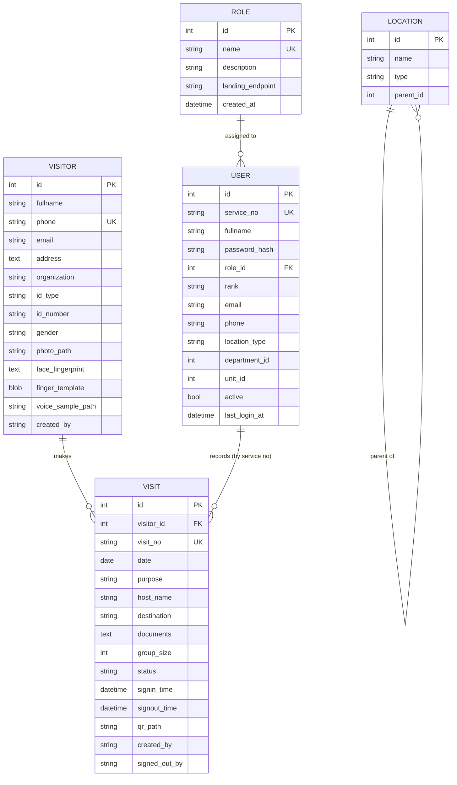

# NCS Visitor Management System — Technical Documentation

**Audience:** Software developers and maintainers
**Version:** 1.0
**Last updated:** 22 September 2026

---

## Table of Contents

1. [Overview](#1-overview)
2. [Technology Stack](#2-technology-stack)
3. [Project Structure](#3-project-structure)
4. [Getting Started](#4-getting-started)
5. [Configuration](#5-configuration)
6. [Architecture](#6-architecture)
7. [Data Model](#7-data-model)
8. [Authentication and Authorisation](#8-authentication-and-authorisation)
9. [The Instance Path — Important](#9-the-instance-path--important)
10. [Database Migrations and Seeding](#10-database-migrations-and-seeding)
11. [API Reference](#11-api-reference)
12. [Visitor Photo Pipeline](#12-visitor-photo-pipeline)
13. [Face Matching — How It Really Works](#13-face-matching--how-it-really-works)
14. [Frontend Architecture](#14-frontend-architecture)
15. [Security Considerations](#15-security-considerations)
16. [Known Limitations and Technical Debt](#16-known-limitations-and-technical-debt)
17. [Testing and Verification](#17-testing-and-verification)
18. [Extending the System](#18-extending-the-system)
19. [Troubleshooting for Developers](#19-troubleshooting-for-developers)

---

## 1. Overview

The NCS VMS is a **Flask monolith** for visitor registration, check-in/check-out
tracking and visit reporting. It is deliberately simple: a single application file,
a small set of SQLAlchemy models, server-rendered Jinja templates and a handful of
JSON endpoints.

The design goal is a **working prototype** that a reception desk can actually use,
with a clear path to production hardening. It is not currently hardened for
production; see [Security Considerations](#15-security-considerations).

### What it does well

- Clean separation between a **Visitor** (a person) and a **Visit** (one entry event)
- Database-backed authentication with hashed passwords and role-based routing
- Deterministic database location regardless of working directory
- Self-healing schema migration for SQLite

### What it does not do

- No blueprints or application factory — one global `app` object
- No Alembic/Flask-Migrate — migrations are hand-rolled
- No automated test suite
- The "face recognition" is perceptual hashing, not biometric matching

---

## 2. Technology Stack

| Layer | Technology | Notes |
| --- | --- | --- |
| Language | Python 3.9+ | Tested on 3.12 |
| Web framework | Flask | Single global app object |
| ORM | Flask-SQLAlchemy | SQLAlchemy 2.x style |
| Database | SQLite | Local development; file-based |
| Auth | Werkzeug security | `scrypt` password hashing |
| Images | Pillow (PIL) | Portrait processing |
| QR codes | `qrcode` | Visit slips |
| Config | `python-dotenv` | Optional `.env` loading |
| Frontend | Bootstrap 5 | Vendored locally under `static/` |
| Face detection | Browser native `FaceDetector`, fallback `face-api.js` | Client-side only |
| Tunnelling | `pyngrok` | Optional, for demos |
| CORS | Flask-Cors | Applied globally |

`requirements.txt`:

```text
Flask
Flask-Cors
Flask-SQLAlchemy
Pillow
python-dotenv
pyngrok
qrcode
```

---

## 3. Project Structure

```text
vms/
├── README.md
├── requirements.txt
├── .env.example
├── docs/
│   ├── USER_GUIDE.md
│   ├── TECHNICAL_DOCUMENTATION.md
│   ├── MANAGEMENT_PRESENTATION.md
│   ├── BUSINESS_REQUIREMENTS.md
│   └── images/                     # Documentation screenshots
├── images/                         # Source logo (duplicate)
├── instance/                       # Legacy DB location — see §9
└── ncs_vms/                        # The application
    ├── app.py                      # Everything: models, routes, helpers
    ├── __init__.py                 # Empty (not an app factory)
    ├── instance/                   # ACTIVE runtime data (see §9)
    │   ├── ncs_vms.db
    │   └── photos/                 # Visitor portraits
    ├── static/
    │   ├── css/
    │   │   ├── bootstrap.min.css
    │   │   └── landing.css         # Landing page styles
    │   ├── js/bootstrap.bundle.min.js
    │   └── img/
    │       ├── logo.png
    │       └── visit_*.png         # Generated QR slips
    └── templates/
        ├── base.html               # Shared shell + role-aware navbar
        ├── login.html              # Standalone landing + login modal
        ├── checkin.html            # Reception workflow
        ├── visits_today.html
        ├── visits_history.html
        ├── forbidden.html          # 403 page
        ├── admin_dashboard.html
        ├── admin_users.html
        ├── admin_roles.html
        ├── admin_locations.html
        └── admin_reports.html
```

> **Note:** `ncs_vms/__init__.py` is empty. The app is **not** structured as a
> package with an application factory. Everything lives in `app.py`.

---

## 4. Getting Started

```bash
python -m venv .venv
source .venv/bin/activate
pip install -r requirements.txt
python ncs_vms/app.py
```

The app serves on <http://localhost:5100> by default.

### Default credentials

Created automatically on first run when the `user` table is empty:

| Service No | Password |
| --- | --- |
| `ADMIN` | `NCS-1234` |

Configurable via `DEFAULT_ADMIN_SERVICE_NO` and `DEFAULT_ADMIN_PASSWORD`.

> **Change these immediately** for anything beyond local development.

---

## 5. Configuration

All configuration is environment-driven (optionally via `.env`).

| Variable | Default | Purpose |
| --- | --- | --- |
| `PORT` | `5100` | HTTP port |
| `FLASK_DEBUG` | `1` | Debug mode (`1/true/yes/on`) |
| `SECRET_KEY` | `dev-secret-change-me` | Flask session signing |
| `DEFAULT_ADMIN_SERVICE_NO` | `ADMIN` | Seeded admin service number |
| `DEFAULT_ADMIN_PASSWORD` | `NCS-1234` | Seeded admin password |
| `NCS_ENABLE_NGROK` | off | Enable the ngrok tunnel |
| `NGROK_AUTHTOKEN` | — | ngrok authentication token |
| `NGROK_DOMAIN` | — | Reserved/static domain |
| `NGROK_REGION` | — | ngrok region |

Configuration is read in this order: `load_dotenv()` (if `python-dotenv` is
installed), then `os.environ`.

---

## 6. Architecture

```text
        Browser
   ┌───────┴────────┐
   │                │
Landing page    Module UI
(login.html)   (templates)
   │                │
   └────────┬───────┘
            ▼
        Flask app.py
   ┌────────┼────────┬──────────┐
   ▼        ▼        ▼          ▼
SQLAlchemy  QR    Pillow    Session auth
   │      gen     (Pillow)   (Werkzeug)
   ▼
SQLite  (ncs_vms/instance/ncs_vms.db)
```

### Request lifecycle

1. Flask routes the request.
2. A guard (`require_*_session`) checks the session and role.
3. The handler queries SQLAlchemy or renders a Jinja template.
4. JSON endpoints return dictionaries built by `visitor_to_dict` / `visit_to_dict`.

### Module routing

The landing destination is driven by data, not code. `Role.landing_endpoint`
stores a Flask endpoint name; after login the app redirects to it:

```python
def landing_endpoint_for_session():
    landing = session.get('role_landing')
    if landing and landing in app.view_functions:
        return landing
    return 'checkin'
```

This means an administrator can create a new role and point it at any registered
endpoint without a code change.

---

## 7. Data Model

### Entity relationships



### Key design decisions

**Visitor vs Visit separation.** A `Visitor` is a person and is registered once.
A `Visit` is a single entry event. This is what allows returning visitors to be
recognised and their history to be reviewed. `Visit.visitor_id` is the link.

**`phone` is unique on Visitor.** It is the natural key used for duplicate
detection. Email is checked as a secondary key.

**Audit fields are service numbers, not foreign keys.** `Visit.created_by` and
`Visit.signed_out_by` store the officer's service number as a string. This means
the audit trail survives even if a user account is later deleted — deliberate, but
it does mean there is no referential integrity to the `user` table.

**Reserved columns.** `Visitor.finger_template` (BLOB), `Visitor.voice_sample_path`
and `Visit.synced` exist for planned future functionality and are currently unused.

**The `Officer` model is dead code.** It predates the `User`/`Role` model and is
never referenced. It can safely be removed.

### Enumerated values

| Field | Values |
| --- | --- |
| `Location.type` | `department`, `command`, `unit` |
| `Visit.purpose` | `official`, `personal` |
| `Visit.status` | `in`, `out` |
| `User.location_type` | `HQ`, `Command` |
| `User.rank` | `NCS_RANKS` in `app.py`: `AC`, `CSC`, `DSC`, `SC`, `CA III`, `CA II`, `CA I`, `AIC`, `IC`, `ASC II`, `ASC I` |
| `Role.name` (built-in) | `Admin`, `Officer`, `Department` |

SQLite does not enforce these — they are validated in application code.

---

## 8. Authentication and Authorisation

### Password storage

```python
def set_password(self, raw_password):
    self.password_hash = generate_password_hash(raw_password)

def check_password(self, raw_password):
    if not self.password_hash:
        return False
    return check_password_hash(self.password_hash, raw_password)
```

Werkzeug's default is `scrypt` (salted). Never store or log raw passwords.

### Session contents

After a successful login, `start_user_session()` populates:

| Key | Value |
| --- | --- |
| `user_id` | `User.id` |
| `desk_officer` | Service number (used in audit fields) |
| `user_name` | Full name |
| `role` | Role name |
| `role_landing` | Landing endpoint name |

### Guards

Four guard families enforce access. Each returns `None` on success, or a response
to return immediately:

| Guard | Use | Failure |
| --- | --- | --- |
| `require_officer_session()` | Pages needing any login | Redirect to `/` |
| `require_reception_session()` | Reception pages (not department) | Redirect to `/` or `/verify` |
| `require_admin_session()` | Admin pages | Redirect, or 403 page |
| `require_api_officer_session()` | JSON APIs needing any login | 401 JSON |
| `require_api_reception_session()` | Reception JSON APIs | 401 or 403 JSON |
| `require_api_admin_session()` | Admin JSON APIs | 401 or 403 JSON |

Usage pattern:

```python
@app.route('/admin/users')
def admin_users():
    gate = require_admin_session()
    if gate:
        return gate
    ...
```

### Role scoping

| Role | Can reach |
| --- | --- |
| `Admin` | Everything |
| `Officer` | Reception pages and APIs, plus `/verify` |
| `Department` | **`/verify` and the verification APIs only** |

Department accounts are deliberately blocked from visitor records. `checkin`,
`visits_today`, `visits_history` and every visitor/visit API use the *reception*
guards, which redirect or return 403 for department users.

> **When adding a route:** decide which guard it needs. A new page under the
> reception module must use `require_reception_session`, not
> `require_officer_session`, or department stations will be able to reach it.

### Self-protection rules

Admins cannot lock themselves out. These are enforced server-side:

- cannot **delete** their own account
- cannot **disable** their own account
- cannot **change** their own role

### Disabled accounts

A disabled user (`active = False`) is rejected at login with HTTP 403 and a
message. Existing sessions are **not** invalidated — see the limitations section.

### Sessions outlive the account

Session state is written once at login and is **not revalidated on each request**.
The guards read `session['user_id']` and `session['role']`; they do not re-query the
database. Consequences:

- Disabling a user does **not** end their active session; they keep their previous
  access until the cookie expires.
- **Deleting** a user leaves any existing session fully functional. The session
  still carries the old `user_id`, service number and role, so the holder can still
  reach pages for that role until they log out.

This was observed in practice: after deleting a test officer account, a browser
retained access to `/checkin` as an "Officer".

**To check a session's age**, note that Flask's default session cookie is not
permanent, so it lasts for the browser session. Add explicit expiry and per-request
user lookup to close this gap — see the limitations section.

---

## 9. The Instance Path — Important

**This is a subtle bug that has been fixed. Understand it before changing
anything related to paths.**

Flask resolves its instance folder from the application root path. When a file is
executed directly (`python ncs_vms/app.py`), the entry point is `__main__`, and
`get_root_path('__main__')` returns the **current working directory**.

This meant the database location silently depended on where the app was launched:

| Launch command | Working dir | Database actually used |
| --- | --- | --- |
| `cd /home/henry/vms && python ncs_vms/app.py` | repo root | `instance/ncs_vms.db` |
| `cd /home/henry/vms/ncs_vms && python app.py` | `ncs_vms/` | `ncs_vms/instance/ncs_vms.db` |
| `import app` from a script | repo root | `instance/ncs_vms.db` |

Two different databases, two different sets of data, depending on invocation.

**The fix** pins the instance path to the package directory:

```python
app = Flask(__name__)

# Flask resolves the instance folder from the application root. When this file is
# run directly ("python ncs_vms/app.py") the root becomes the working directory,
# so the database location would depend on where the app was launched from. Pin
# the instance path to the package directory so it is always the same file.
app.instance_path = os.path.join(os.path.dirname(os.path.abspath(__file__)), 'instance')
os.makedirs(app.instance_path, exist_ok=True)
```

The canonical database is therefore always:

```
ncs_vms/instance/ncs_vms.db
```

> **The top-level `instance/` directory is legacy.** It may contain stale data from
> before the fix. It is not read by the application.

### 9.1 A second way to get the wrong database: stale processes

Even after the fix, two databases can reappear if you leave an old server running.
The Flask development reloader runs a parent **and** a child process, and Werkzeug
binds the listening socket with `SO_REUSEPORT`. This means **two separate processes
can share a single port**, and a request may be served by either one.

A server started *before* a code change keeps serving **the code it loaded at
startup**, and holds whichever database file it opened at that time. The symptom is
a login that works on one machine and fails on another, or data that changes
between refreshes.

**Diagnose it:**

```bash
# Any duplicated processes bound to one port?
ss -ltnp | grep python

# Which database does a given process actually hold open?
ls -l /proc/<pid>/fd | grep '\.db'

# How old is the process versus the code?
ps -o pid=,lstart= -p <pid>
stat -c '%y' ncs_vms/app.py
```

If a process started before `app.py` was last modified, it is running stale code.

**Fix it — always restart cleanly rather than starting a second copy:**

```bash
pkill -f "ncs_vms/app.py"
sleep 1
PORT=5100 ./.venv/bin/python ncs_vms/app.py
```

> **Rule of thumb:** after editing `app.py`, kill the old process first. Do not
> assume a second `python ncs_vms/app.py` replaces the first.

---

## 10. Database Migrations and Seeding

There is no Alembic. Migrations use SQLite's `ALTER TABLE` via a helper:

```python
def add_missing_columns(table_name, columns):
    existing = {row[1] for row in db.session.execute(
        text(f"PRAGMA table_info({table_name})")).fetchall()}
    for name, definition in columns.items():
        if name not in existing:
            db.session.execute(text(
                f"ALTER TABLE {table_name} ADD COLUMN {name} {definition}"))
    db.session.commit()
```

`migrate_database()` runs `db.create_all()`, then adds any missing columns, then
calls `seed_roles()`. It executes at import time:

```python
with app.app_context():
    migrate_database()
```

### Seeding

`seed_roles()` is idempotent:

1. Ensures the `Admin` and `Officer` roles exist, updating their `landing_endpoint`
   if it has drifted.
2. If **no users exist at all**, creates the default admin account.

### Adding a column — the pattern

1. Add the column to the model.
2. Add an entry to the relevant `add_missing_columns` call in `migrate_database()`.
3. Restart the app.

```python
add_missing_columns('visitor', {
    'new_field': 'VARCHAR(100)',
})
```

> **Limitations:** SQLite cannot drop or rename columns via this helper, and there
> is no version tracking or rollback. For production, migrate to Flask-Migrate.

---

## 11. API Reference

All endpoints require an authenticated session. Admin endpoints additionally
require the `Admin` role.

### Page routes

| Method | Path | Guard | Purpose |
| --- | --- | --- | --- |
| GET | `/` | — | Landing page, or redirect if signed in |
| POST | `/login` | — | Authenticate |
| GET | `/logout` | — | Clear session |
| GET | `/checkin` | Reception | Reception check-in UI |
| GET | `/verify` | Any authenticated | Camera-only visitor verification |
| GET | `/visits/today` | Reception | Today's visits table |
| GET | `/visits/history` | Officer | Filterable visit history |
| GET | `/admin` | Admin | Redirect to dashboard |
| GET | `/admin/dashboard` | Admin | Admin landing page |
| GET | `/admin/users` | Admin | User management UI |
| GET | `/admin/roles` | Admin | Role management UI |
| GET | `/admin/locations` | Admin | Location management UI |
| GET | `/admin/reports` | Admin | Filterable reports UI |

### Visitor APIs

| Method | Path | Guard | Purpose |
| --- | --- | --- | --- |
| GET | `/api/visitors` | Officer | List/search visitors (`?q=`) |
| GET | `/api/visitor/<id>` | Officer | One visitor plus history |
| POST | `/api/visitor/<id>/update` | Officer | Update a visitor |
| GET | `/api/visitor/<id>/photo` | Officer | Serve the portrait |
| GET | `/api/visitor/search` | Officer | Find by phone or email (`?q=`) |
| POST | `/api/visitor/create` | Officer | Create a visitor (form data) |
| POST | `/api/visitor/face-search` | Officer | Match a captured photo |
| POST | `/api/visitors/rebuild-face-index` | Officer | Recompute all fingerprints |

### Visit APIs

| Method | Path | Guard | Purpose |
| --- | --- | --- | --- |
| GET | `/api/visits` | Reception | Recent visits (`?status=in`) |
| GET | `/api/visits/history` | Reception | Filtered history |
| GET | `/api/visit/<id>/details` | Reception | Full visit + visitor detail for the modal |
| POST | `/api/visit/create` | Reception | Create a visit and QR slip |
| POST | `/api/visit/signout` | Reception | Sign a visit out |

### Verification APIs (department stations)

These are intentionally available to **any authenticated user**, including the
`Department` role, and return **no personal data**.

| Method | Path | Guard | Purpose |
| --- | --- | --- | --- |
| POST | `/api/verify/face` | Any authenticated | Match a frame, return status only |
| GET | `/api/verify/status` | Any authenticated | Station health check |

`POST /api/verify/face` accepts `photo_data` (a base64 data URL) and returns:

```json
{
  "ok": true,
  "status": "active",
  "label": "VERIFIED — ON SITE",
  "message": "Visitor is verified and currently signed in.",
  "visitor_name": "JOHN DOE",
  "visit_no": "NCS/26/09/22/0001",
  "signed_in_at": "09:14",
  "match_score": 0.97
}
```

| `status` | Meaning |
| --- | --- |
| `active` | Matched, and the visitor is currently signed in |
| `inactive` | Matched, but no active visit today |
| `unknown` | No matching visitor record |

Deliberately **not** returned: phone, email, address, ID numbers, organisation,
photo URL, or visit history. A test asserts these never appear in the response.

### Admin APIs

| Method | Path | Purpose |
| --- | --- | --- |
| GET | `/api/admin/stats` | Dashboard counters |
| POST | `/api/admin/users` | Create a user |
| POST | `/api/admin/users/<id>/update` | Update a user |
| POST | `/api/admin/users/<id>/toggle` | Enable/disable a user |
| POST | `/api/admin/users/<id>/delete` | Delete a user |
| POST | `/api/admin/roles` | Create a role |
| POST | `/api/admin/roles/<id>/update` | Update a role |
| POST | `/api/admin/roles/<id>/delete` | Delete a role |
| POST | `/api/admin/locations` | Create a location |
| POST | `/api/admin/locations/<id>/delete` | Delete a location |

### History filter parameters

`build_history_query(args)` is shared by `/visits/history`, `/api/visits/history`
and `/admin/reports`, so all three accept identical filters:

| Parameter | Effect |
| --- | --- |
| `q` | Matches visitor name, phone, visit no, host, destination |
| `status` | `in` or `out` |
| `purpose` | `official` or `personal` |
| `year` | Exact year via `strftime('%Y', date)` |
| `month` | 1–12 via `strftime('%m', date)` |
| `date_from` | Inclusive lower bound |
| `date_to` | Inclusive upper bound |

Invalid values are **silently ignored** rather than raising errors, so a malformed
URL degrades to a broader result set instead of a 500.

### Error response shapes

```json
{ "ok": false, "error": "login_required" }
{ "ok": false, "error": "forbidden" }
{ "ok": false, "error": "invalid_phone",
  "message": "Phone number must contain exactly 11 digits." }
{ "ok": false, "error": "active_visit_exists",
  "message": "…already has an active visit today (NCS/…). Sign it out before…",
  "active_visit": { "visit_no": "…", "status": "in" } }
```

---

## 12. Visitor Photo Pipeline

Photos arrive as base64 data URLs from the browser canvas.

```text
Browser canvas
   │  toDataURL('image/jpeg')
   ▼
data:image/jpeg;base64,…
   │  decode_data_image()
   ▼
PIL Image (RGB)
   │  make_professional_portrait()
   │    ├─ exif_transpose()      correct orientation
   │    ├─ thumbnail(520×650)    fit within bounds
   │    └─ paste onto 480×600 white canvas
   ▼
Saved to ncs_vms/instance/photos/visitor_<uuid>.jpg
   │
   ▼
face_fingerprint computed and stored
```

Key functions:

| Function | Role |
| --- | --- |
| `decode_data_image` | Validates the prefix, decodes base64 to a PIL Image |
| `make_professional_portrait` | Normalises size, orientation and background |
| `save_visitor_photo` | Writes the file, returns `(path, fingerprint)` |
| `portrait_data_url` | Returns a processed portrait as a data URL |

The canvas crop in `checkin.html` (`cropProfessionalPortrait`) is computed from the
detected face box, so the portrait is framed consistently. The server re-processes
whatever it receives, so the client crop is a convenience, not a security boundary.

> **Cleanup:** portrait files are never deleted when a visitor or visit is deleted.
> Introducing orphaned-photo cleanup is a recommended improvement.

---

## 13. Face Matching — How It Really Works

**This is not biometric face recognition.** It is perceptual image hashing. Being
clear about this matters for both security and for anyone extending the feature.

### 13.1 The algorithm

Fingerprints are computed from the **content-cropped, brightness-normalised**
portrait, in three parts of 256 bits each (768 bits total):

| Fingerprint | Function | Method |
| --- | --- | --- |
| Difference hash | `image_fingerprint` | 17×16 grey, compare horizontally adjacent pixels → 256 bits |
| Average hash | `average_fingerprint` | 16×16 grey, threshold each pixel against the mean → 256 bits |
| Centre-crop average | `center_fingerprint` | Centred square crop, then average hash → 256 bits |

Two preprocessing steps are essential and were added after measuring the original
implementation:

1. **`crop_to_content`** — portraits are pasted onto a white 480×600 canvas, so
   about a third of the image carries no facial information. Hashing the full
   canvas lets the background dominate the result.
2. **`normalize_for_hash`** — `autocontrast` before hashing, so uniform brightness
   changes do not produce a completely different hash for the same person.

Without these, discrimination collapsed entirely: in testing, the original code
matched **90 of 90 pairs of different people**.

### 13.2 Matching

`fingerprint_match_distance(probe, stored)` returns the **sum** of the Hamming
distances across the three components.

> **Sum, not minimum.** An earlier version took the minimum across components,
> which meant a match only needed one component to be close. Three components each
> scoring ~25 would report 25 instead of ~75, and almost anyone matched. If you
> refactor this function, preserve the summation.

Stored values are prefixed with a version marker (`v2:`). A value without the
current marker returns `None`, which signals callers to rebuild it from the saved
portrait rather than silently comparing incompatible formats.

### 13.3 Measured accuracy

On synthetic test faces (768-bit fingerprints, threshold 60):

| Comparison | Distance |
| --- | --- |
| Identical image | 0 |
| Same person, mild brightness change | up to ~10 |
| **Different people** | **42 or more** (average ~100) |

With the threshold at 60: **0 false negatives** and roughly **9% false
positives** on the synthetic set.

### 13.4 Why this is still a weak signal

- It compares **overall image structure**, not facial features
- Similar lighting, pose and background can still produce a false match
- Different angles, expressions or strong lighting produce false negatives
- Brightness *increases* were observed to cause failures even after
  normalisation, so it is not lighting-invariant
- The threshold is a tuned heuristic on synthetic data, **not** a calibrated
  metric on real faces
- **It must never be the sole basis for a security decision**

### 13.5 Appropriate use

It is a **convenience shortcut** for greeting known regular visitors, and for the
department verification station it should be treated as a helpful indicator only.
The reliable path is always searching by phone number at reception.

If genuine biometric matching is required, replace this with a proper face
embedding model (for example a FaceNet-style network), store embeddings, and
calibrate a distance threshold against real data.

### 13.6 Changing the algorithm

The seams are:

- `portrait_fingerprints(img)` — produces the stored representation
- `fingerprint_match_distance(probe, stored)` — scores a candidate
- `FINGERPRINT_MATCH_THRESHOLD` — the accept/reject boundary

After changing any of these, **bump `FINGERPRINT_VERSION`** so old values are
rejected and rebuilt, then call `/api/visitors/rebuild-face-index`.

---

## 14. Frontend Architecture

### Template inheritance

`base.html` provides the shell: the navbar, Bootstrap, and the `content` and
`scripts` blocks. All module pages extend it.

`login.html` is **standalone** — it does not extend `base.html` because it is the
public landing page with its own hero and styling.

The navbar is **role-aware**:

```jinja

  … Dashboard, Users, Roles, Locations, Reports, Reception …

  … Check-In, Today's Visits, History …

```

This is presentation only. **The server enforces access independently** — hiding a
link is never the security control.

### JavaScript approach

Plain ES5-compatible JavaScript in ``. No build step, no
framework, no bundler. Each page is self-contained.

| Page | Notable client logic |
| --- | --- |
| `checkin.html` | Camera, face detection, canvas crop, AJAX forms |
| `visits_today.html` | Live table filtering, per-row sign-out |
| `visits_history.html` | Server-side filters, client CSV export |
| `admin_users.html` | Modal form, AJAX CRUD, self-protection messaging |
| `admin_roles.html` / `admin_locations.html` | Modal forms, AJAX CRUD |
| `admin_reports.html` | Filters, CSV export |

### Face detection on the client

Two strategies, tried in order:

1. **Native `FaceDetector`** — the browser Shape Detection API, if available
2. **`face-api.js`** — `TinyFaceDetector` loaded from a CDN as a fallback

Detection runs on a timer and only classifies the scene (single face, no face,
multiple faces). It never identifies anyone on the client. The captured crop is
sent to the server, which performs the matching described above.

### Client-side validation

Mirrors server rules for responsiveness, but the server is authoritative:

- Names upper-cased as you type
- Phone strips non-digits and caps at 11 characters
- `pattern="\d{11}"` on phone inputs

### CSV export

A `Blob` is built from the rendered table and downloaded. It exports exactly what is
on screen, so it respects the active filters. No server involvement.

---

## 15. Security Considerations

### Implemented

| Control | Implementation |
| --- | --- |
| Password hashing | Werkzeug `scrypt`, salted |
| Session-based auth | Signed Flask cookie |
| Role-based access | Server-side guards on every route |
| Disabled accounts | Rejected at login |
| Self-lockout protection | Cannot delete/disable/demote self |
| Duplicate prevention | Unique phone; email secondary check |
| Business rule | One active visit per visitor per day |
| Data exclusion | DB, photos and QR slips gitignored |

### Required before production

| Risk | Mitigation |
| --- | --- |
| **No CSRF protection** | Add Flask-WTF `CSRFProtect`; all POSTs are currently unprotected |
| **Default admin credentials** | Must be changed; currently seeded as `ADMIN`/`NCS-1234` |
| **`SECRET_KEY` fallback** | Defaults to a known value; must be set to a strong random secret |
| **No rate limiting** | Add throttling on `/login` to resist brute force |
| **No HTTPS** | Terminate TLS; cookies are not marked `Secure` |
| **No session invalidation** | Disabling a user does not end their existing session |
| **No audit log** | Only visit-level created/signed-out fields are recorded |
| **Plaintext PII at rest** | SQLite file and photos are unencrypted |
| **No retention policy** | Visitor data is kept indefinitely |
| **Photos never deleted** | Orphaned files accumulate |
| **Unvalidated `landing_endpoint`** | Constrained to `app.view_functions`, which is checked — good, but keep it that way |

### Things to be careful about when editing

- Never trust the client-side crop or validations; the server re-validates.
- Any new admin route must call `require_admin_session()` or
  `require_api_admin_session()`.
- Any new POST endpoint inherits the CSRF gap. Do not treat it as safe.
- Do not add avatar/photo files to source control — see the git history note in the
  repository README.

---

## 16. Known Limitations and Technical Debt

Ordered roughly by impact.

1. **No CSRF protection.** All POST endpoints are vulnerable. Highest priority fix.
2. **Single-file application.** `app.py` is ~1500 lines. Splitting into blueprints
   would improve maintainability.
3. **No automated tests.** Verification has been manual and scripted ad hoc.
4. **`datetime.utcnow()` is deprecated** in Python 3.12 and emits warnings. Replace
   with `datetime.now(timezone.utc)` for timezone-aware values.
5. **The `Officer` model is dead code** — remove it.
6. **Legacy top-level `instance/` directory** still exists and may confuse
   newcomers. Consider deleting it.
7. **Sessions are not revalidated.** Deleting or disabling a user does not end
   their session. Look up the user on each request and reject if missing/inactive.
8. **Restarting with a stale process yields two databases.** See §9.1.
9. **Photo files are never garbage-collected.**
10. **Face matching is weak** (perceptual hashing, not biometric).
11. **`Visitor.email` has no unique constraint** at the database level; duplicates
    are only prevented in application code, and only case-insensitively.
12. **History and reports cap at 500 rows** with no pagination. Fine for a
    prototype; not for scale.
13. **No foreign key from visits to users** — audit fields are free-text service
    numbers.
14. **`Visitor` and `Visit` have no delete endpoints**, so cleanup requires direct
    database access.
15. **CORS is enabled globally** (`CORS(app)`) with default permissive settings.
16. **SQLite** is unsuitable for concurrent multi-desk use; move to PostgreSQL.

---

## 17. Testing and Verification

There is no test suite. The methods used during development:

### Using the Flask test client

```python
import sys
sys.path.insert(0, 'ncs_vms')
from app import app, db, User, Role

client = app.test_client()
r = client.post('/login', data={'service_no': 'ADMIN', 'password': 'NCS-1234'})
assert r.status_code == 302

# Simulate an authenticated session directly
with client.session_transaction() as s:
    s['user_id'] = 1
    s['desk_officer'] = 'ADMIN'
    s['role'] = 'Admin'
```

### Areas that were verified

| Area | Check |
| --- | --- |
| Role routing | Admin → `/admin/dashboard`, Officer → `/checkin` |
| RBAC | Officer blocked (403) from all admin pages and APIs |
| Auth failures | Wrong password → 401; disabled account → 403 |
| Self-protection | Delete/disable/demote self all rejected |
| Phone validation | 10, 12 digits and letters rejected; dashes stripped and accepted |
| Name normalisation | `"john doe"` stored as `"JOHN DOE"` |
| Password hashing | Stored value is a scrypt hash, `check_password` verifies |
| One active visit | Second visit on the same day → 409 with message |
| History filters | Every filter combination across dates spanning two years |
| Instance path | Stable regardless of working directory |

### Suggested test suite

If you add pytest, start with these:

- `test_auth.py` — login, logout, disabled accounts, bad credentials
- `test_rbac.py` — every admin route rejects non-admins
- `test_validation.py` — phone, name and password rules
- `test_visits.py` — create, duplicate-active-visit, sign-out
- `test_admin.py` — CRUD, self-protection, role-in-use protection
- `test_filters.py` — history filter combinations

Use an in-memory SQLite database and a fixture that seeds roles via `seed_roles()`.

---

## 18. Extending the System

### Adding a new page to the reception module

1. Add a route guarded by `require_officer_session()`.
2. Create a template extending `base.html`.
3. Add a navbar link inside the `` (non-admin) branch of `base.html`.

### Adding a new admin feature

1. Add a route guarded by `require_admin_session()` (page) or
   `require_api_admin_session()` (JSON).
2. Add the template under `templates/`.
3. Add it to the admin navbar branch.
4. Remember to handle the 403 case in the UI.

### Adding a role with a custom landing page

Roles are data, so:

1. Create the page and its route.
2. In **Admin → Roles**, create the role and set **Landing Module** to that
   endpoint name (validated against `app.view_functions`).
3. Assign users to the role. They are redirected there automatically after login.

### Adding a database column

Follow the pattern in §10. Append to the relevant `add_missing_columns` call and
the migration is applied on next start.

### Replacing the face matching

The seam is clean:

- `portrait_fingerprints(img)` produces the stored representation
- `fingerprint_match_distance(probe, stored)` scores a candidate

Swap both, and call `/api/visitors/rebuild-face-index` to regenerate stored values
for existing visitors. Keep the storage in `Visitor.face_fingerprint` (TEXT) or
introduce a new column via the migration helper.

### 18.1 The ngrok tunnel lifecycle

Ngrok support is optional and off by default. When enabled, the tunnel is started
from `__main__` and the agent must be cleaned up when the process ends.

**The failure mode.** A reserved ngrok domain can be claimed by only **one agent at
a time**. If a previous run's agent is still alive, the next start fails:

```text
ERR_NGROK_334: The endpoint 'https://…ngrok-free.dev' is already online.
```

This is easy to trigger: the Flask reloader spawns a parent and a child process, so
a naive implementation starts **two** agents, and a server stopped with `kill` or
`pkill` leaves its agent orphaned.

**How the current code handles it:**

| Concern | Handling |
| --- | --- |
| Duplicate agents from the reloader | Only the child (`WERKZEUG_RUN_MAIN=true`) starts a tunnel |
| Tunnels left by a previous run | `start_ngrok_tunnel` disconnects existing tunnels first |
| Clean exit | `atexit` handler |
| `SIGTERM` / `SIGINT` (Ctrl+C, `kill`, `pkill`) | Explicit signal handlers — `atexit` does **not** run on signals |
| Unhelpful raw errors | `ERR_NGROK_334` and auth failures print an actionable message |

> **Why signal handlers are required:** `atexit` only runs on normal interpreter
> shutdown. A server is almost always stopped with a signal, so relying on
> `atexit` alone leaves the agent running.

**If you still hit `ERR_NGROK_334`**, a foreign agent holds the domain:

```bash
pkill -f ngrok
# confirm it is gone
ps aux | grep "[n]grok"
# the local agent API should also be free
ss -ltn | grep 4040
```

**Diagnostics.** The ngrok agent exposes a local API on port 4040:

```bash
curl -s http://127.0.0.1:4040/api/tunnels
```

This shows the live tunnel, its public URL, and — importantly — the **local
address it forwards to**. If that address points at a dead port (for example
`localhost:5101` while the app runs on `5100`), the tunnel will appear to work but
every request will fail.

---

## 19. Troubleshooting for Developers

| Symptom | Likely cause |
| --- | --- |
| Data changes in one script but not the running app | Two databases — see §9. Check `app.instance_path`. |
| `Port 5100 is in use` | Another instance is running. Set `PORT=5199`. |
| `favicon.ico` 404 in `base.html` pages | Expected; only `login.html` declares an icon |
| `DeprecationWarning: datetime.utcnow()` | Python 3.12; see limitations |
| Tables missing after a schema change | `migrate_database()` only *adds* columns |
| QR image not updating | Old `visit_*.png` files persist in `static/img/` |
| JS errors around `` in templates | The JS language server cannot parse Jinja; harmless |
| Login succeeds but lands somewhere unexpected | Check `Role.landing_endpoint` for that user's role |
| ngrok fails with `ERR_NGROK_334` | A stale agent holds the reserved domain — `pkill -f ngrok`, then restart |
| ngrok tunnel "works" but the public URL 404s | The tunnel points at a dead port; check `PORT` matches the running server |

### Useful inspection commands

```bash
# Which database is in use, and where
./.venv/bin/python -c "import sys; sys.path.insert(0,'ncs_vms'); import app; \
  print(app.app.instance_path)"

# Inspect contents directly
sqlite3 ncs_vms/instance/ncs_vms.db \
  "select service_no, fullname from user;"

# Count records
sqlite3 ncs_vms/instance/ncs_vms.db \
  "select 'visitors', count(*) from visitor union all \
   select 'visits', count(*) from visit;"
```

### Compile check

```bash
./.venv/bin/python -m py_compile ncs_vms/app.py && echo OK
```

---

## Appendix A — Function Index

| Function | Line (approx.) | Purpose |
| --- | --- | --- |
| `add_missing_columns` | 130 | SQLite `ALTER TABLE` helper |
| `migrate_database` | 140 | Create tables and add missing columns |
| `seed_roles` | 159 | Seed roles and default admin |
| `generate_visit_no` | 191 | Sequential daily visit reference |
| `landing_endpoint_for_session` | 209 | Role-based post-login destination |
| `start_user_session` | 244 | Populate session, record last login |
| `current_user` / `current_role` / `is_admin` | 260 | Session accessors |
| `require_*_session` | 272–294 | Access guards |
| `normalize_name` | 297 | Uppercase and collapse whitespace |
| `digits_only` / `valid_phone` | 303 / 308 | Phone normalisation and validation |
| `decode_data_image` | 313 | Base64 data URL → PIL Image |
| `make_professional_portrait` | 320 | Normalise portrait onto white canvas |
| `image_fingerprint` / `average_fingerprint` / `center_fingerprint` | 329–351 | Perceptual hashes |
| `fingerprint_match_distance` | 381 | Hamming-distance scoring |
| `save_visitor_photo` | 396 | Persist portrait and fingerprint |
| `visitor_to_dict` / `visit_to_dict` | 423 / 443 | JSON serialisation |
| `visitor_history` | 465 | Visits for a visitor |
| `active_visit_for_visitor` | 469 | Business rule: one open visit |
| `build_history_query` | 1026 | Shared filter query builder |
| `parse_date_arg` / `parse_int_arg` | 1008 / 1017 | Tolerant filter parsing |

## Appendix B — Route Quick Reference

```text
Public        GET  /                      landing or redirect
              POST /login
              GET  /logout

Reception     GET  /checkin
              GET  /visits/today
              GET  /visits/history

Admin         GET  /admin  → /admin/dashboard
              GET  /admin/dashboard | users | roles | locations | reports
              ALL  /api/admin/*

APIs          GET  /api/visitors              POST /api/visitor/create
              GET  /api/visitor/<id>          POST /api/visitor/<id>/update
              GET  /api/visitor/<id>/photo    POST /api/visitor/face-search
              GET  /api/visitor/search        POST /api/visitors/rebuild-face-index
              GET  /api/visits                POST /api/visit/create
              GET  /api/visits/history        POST /api/visit/signout
```

---

*NCS Visitor Management System — Technical Documentation v1.0*