# NCS Visitor Management System — User Guide

**Audience:** Reception officers, desk officers, security personnel and system administrators
**Version:** 1.0
**Last updated:** 22 September 2026

---

## Table of Contents

1. [Introduction](#1-introduction)
2. [Getting Started](#2-getting-started)
3. [Signing In](#3-signing-in)
4. [The Reception Module](#4-the-reception-module)
   - 4.1 [Identifying a Visitor](#41-identifying-a-visitor)
   - 4.2 [Registering a New Visitor](#42-registering-a-new-visitor)
   - 4.3 [Creating a Visit](#43-creating-a-visit)
   - 4.4 [The Visitor Slip and QR Code](#44-the-visitor-slip-and-qr-code)
5. [Today's Visits](#5-todays-visits)
6. [Visit History](#6-visit-history)
7. [The Admin Module](#7-the-admin-module)
8. [Troubleshooting](#8-troubleshooting)
9. [Glossary](#9-glossary)

---

## 1. Introduction

The **NCS Visitor Management System (VMS)** replaces the paper visitor register with a
digital workflow. It lets the reception desk:

- register visitors and keep a searchable record of them
- identify returning visitors instantly, so details are not re-typed
- issue each visit a unique reference number and a QR-coded visitor slip
- track who is currently on site and sign them out when they leave
- search and report on all past visits

The system has **two modules**, and which one you see depends on your role:

| Module | Who uses it | What it does |
| --- | --- | --- |
| **Reception** | Officers | Day-to-day visitor check-in, sign-out and history |
| **Admin** | Administrators | Manage users, roles, locations and reports |

---

## 2. Getting Started

### What you need

- A computer with a modern web browser (Chrome, Edge or Firefox)
- Your **Service Number** and **password**, issued by the administrator
- A **webcam** (optional) — used for face check and visitor photographs

### Opening the system

Enter the address provided by your administrator (for example
`http://localhost:5100`) into your browser. You will see the landing page:

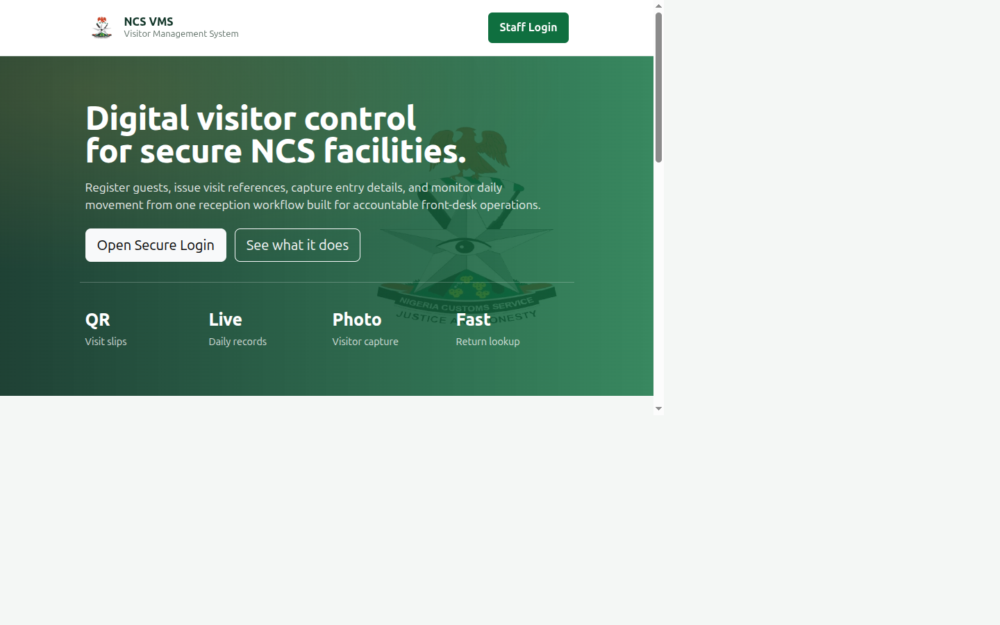

The landing page describes what the system does. To continue, click **Staff Login**
in the top-right corner, or the **Open Secure Login** button.

---

## 3. Signing In

Click **Staff Login**. The login window appears:

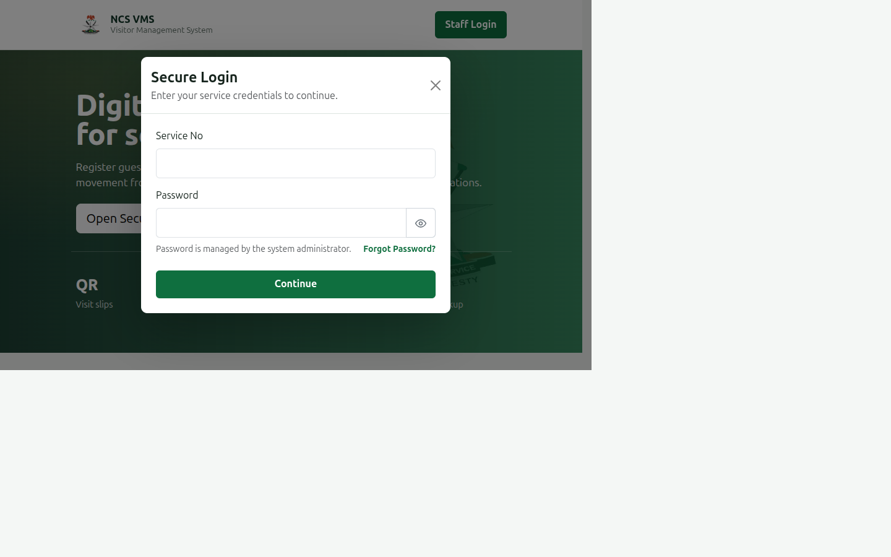

1. Enter your **Service No** (for example `SVC-001`).
2. Enter your **Password**.
   - Click the **eye icon** to show or hide the password.
   - If **Caps Lock** is on, a warning appears below the field.
3. Click **Continue**.

> **Where will I land?**
> The system sends you to the module that matches your role automatically:
> - **Officers** go straight to **Visitor Check-In**.
> - **Administrators** go to the **Admin Dashboard**.

If your details are not recognised you will see *"Invalid service number or password."*
If your account has been disabled you will see a message asking you to contact the
administrator.

### Signing out

Click **Logout** in the top-right corner when you finish your shift. Always sign out
on a shared reception computer.

---

## 4. The Reception Module

After signing in as an officer, you arrive at the check-in screen:

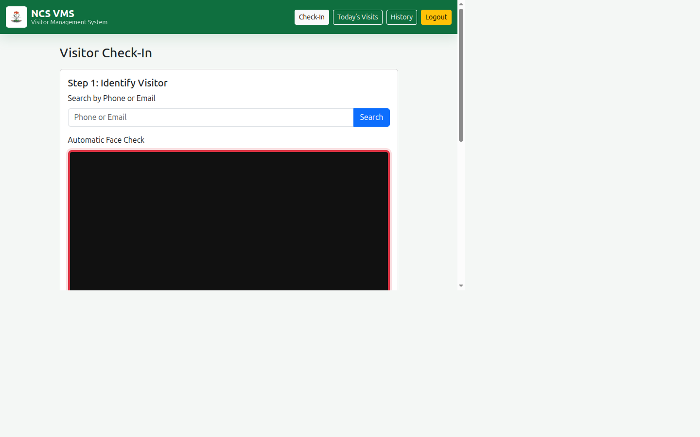

The screen has three steps, which appear as you progress.

### 4.1 Identifying a Visitor

Before registering anyone, check whether they have visited before.

**Method 1 — Search by phone or email**

1. Type the visitor's phone number or email address into the **Search by Phone or
   Email** box.
2. Click **Search**.
3. If the visitor exists, their details and previous visit count appear in green.

**Method 2 — Automatic face check**

If a webcam is connected, the system watches the camera frame for a face.

1. Ask the visitor to look at the camera — one person only.
2. Wait for the message *"Single face detected."*
3. Click **Capture & Search**.

The frame border tells you the result:

| Border colour | Meaning |
| --- | --- |
| 🟩 Green | A matching visitor was found |
| 🟥 Red | No match — this is a new visitor |
| 🟨 Yellow | More than one face is visible — ask others to step aside |

> **Note:** The face check is a convenience feature to speed up returning visitors.
> You can always fall back to searching by phone number.

### 4.2 Registering a New Visitor

If the search finds nobody, the **New Visitor Registration** form opens.

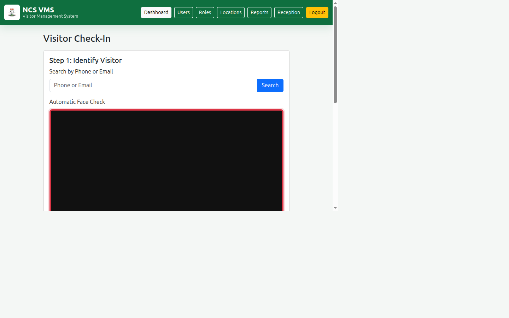

Fill in the details:

| Field | Required | Notes |
| --- | --- | --- |
| **Full Name** | Yes | Automatically converted to UPPERCASE |
| **Phone** | Yes | Exactly **11 digits**; letters and symbols are rejected |
| **Email** | No | Used for future lookups |
| **Gender** | No | |
| **Address** | No | |

The **Professional Portrait** panel shows the captured photograph. The system
automatically crops the face and places it on a clean white background.

Click **Save Visitor**.

> **Duplicate protection:** If the phone number or email already belongs to someone,
> the system will not create a second record. It shows you the existing visitor
> instead, and you continue straight to the visit details.

### 4.3 Creating a Visit

With the visitor identified (existing or newly saved), the **Visit Details** form
becomes available.

1. **Purpose** — select **Official** or **Personal**.
   - Choosing **Personal** reveals two extra fields: *Host / Officer to Visit* and
     *Department / Destination*. The host name is required.
2. **Group Visit?** — select **Yes** if more than one person is entering, then enter
   the **Number of Persons**.
3. **Documents Carried** — record anything the visitor is bringing in.
4. Click **Generate Visit & QR**.

> **One visit at a time:** A visitor cannot hold two active visits on the same day.
> If they are already signed in, the system blocks the new visit and shows a warning
> with their existing visit number and a link to sign them out first.

### 4.4 The Visitor Slip and QR Code

On success, a **Visitor Slip** appears with:

- the unique **Visit No** (format `NCS/YY/MM/DD/NNNN`)
- a **QR code** encoding the visit

The page then returns to a fresh check-in screen, ready for the next visitor.

---

## 5. Today's Visits

Open **Today's Visits** from the menu to see everyone who has entered today.

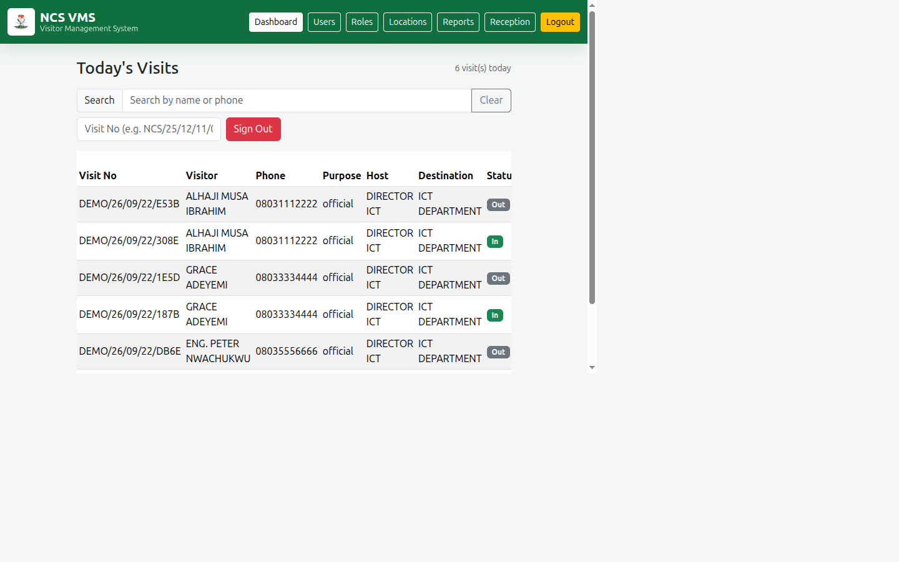

The table shows the visit number, visitor name, phone, purpose, host, destination,
status, sign-in and sign-out times, and the officer who recorded it.

### Searching the list

Use the **Search** box above the table to filter by **name** or **phone number** in
real time. Click **Clear** to reset.

### Signing a visitor out

There are two ways:

**Option A — From the table**

1. Find the visitor's row. Their status shows a green **In** badge.
2. Click the red **Sign Out** button at the right of that row.
3. Confirm the prompt.

**Option B — By visit number**

1. Type the visit number into the **Visit No** box (for example
   `NCS/26/09/22/0001`).
2. Click **Sign Out**.

The visitor's status changes to a grey **Out** badge and the sign-out time is recorded
along with your service number.

---

## 6. Visit History

Open **History** from the menu to search all past visits, not just today's.

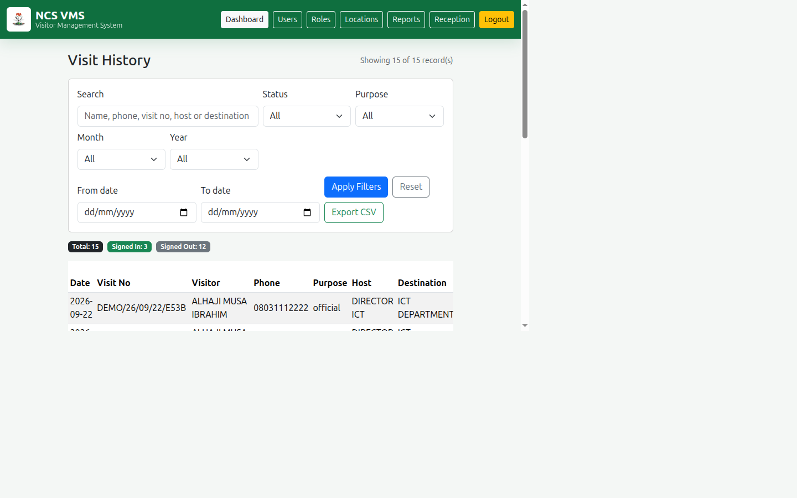

### Filtering

| Filter | What it does |
| --- | --- |
| **Search** | Matches visitor name, phone, visit number, host or destination |
| **Status** | *Signed In* or *Signed Out* |
| **Purpose** | *Official* or *Personal* |
| **Month** | Any month, or all |
| **Year** | Only years that contain data |
| **From date / To date** | A specific date range |

Filters can be combined. Click **Apply Filters** to run the search, or **Reset** to
clear everything.

The badges above the table show the totals for your current filter.

### Exporting

Click **Export CSV** to download the currently displayed results as a spreadsheet
file, which opens in Excel or Google Sheets. This respects whatever filters are
active.

---

## 7. The Admin Module

Administrators see additional menu items. This section is for them.

### 7.1 Dashboard

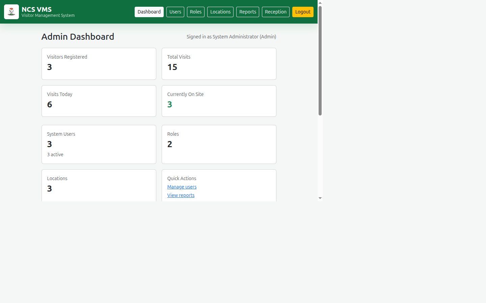

The dashboard summarises the whole system: visitors registered, total visits, visits
today, who is currently on site, system users, roles and locations. The bottom table
lists the most recent visits.

### 7.2 Users

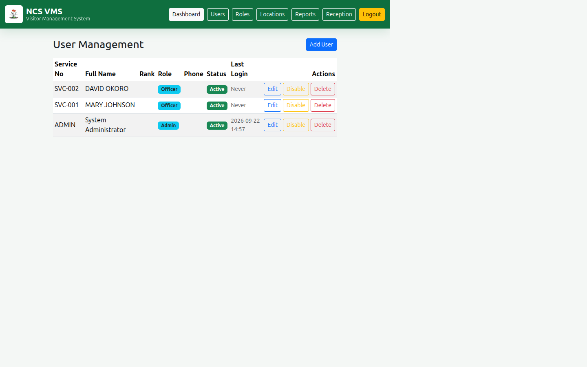

Manage everyone who can sign in.

**To add a user:**

1. Click **Add User**.
2. Complete the form, including **Service No**, **Full Name**, **Role** and
   **Password** (minimum 6 characters).
3. Click **Save User**.

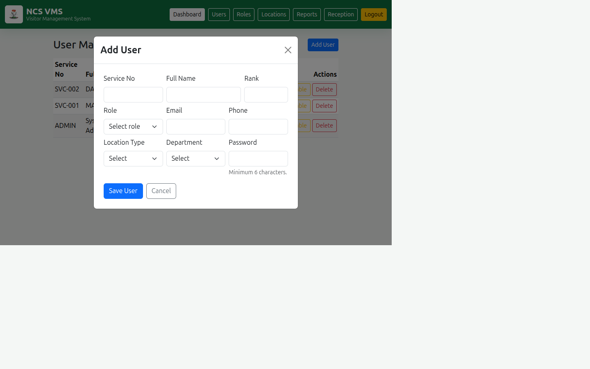

**To edit:** click **Edit** on the user's row. The Service No cannot be changed.
Leave the password blank to keep the existing one.

**To disable or enable:** click **Disable** / **Enable**. A disabled user cannot sign
in. Prefer disabling over deleting — it preserves the audit trail.

**To delete:** click **Delete** and confirm. This is permanent.

> **Safety rule:** You cannot disable, delete or change your own role. This prevents
> locking everyone out of the admin module.

### 7.3 Roles

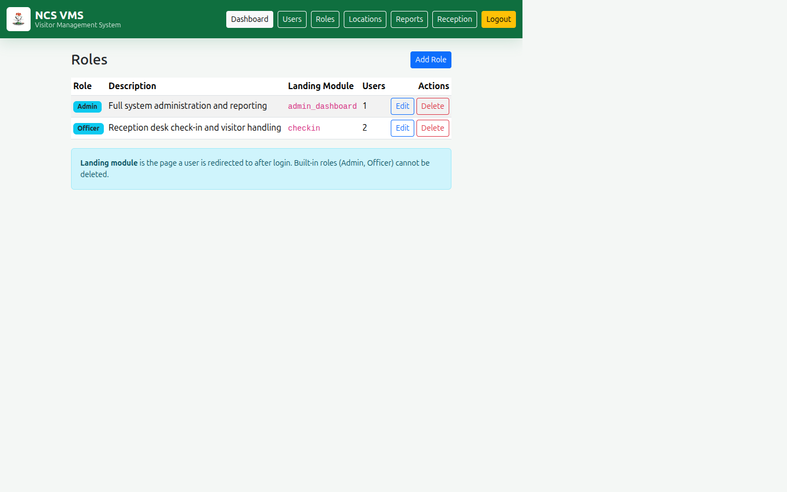

A role determines **which module a user lands on after signing in**. The system ships
with two protected roles:

| Role | Landing module |
| --- | --- |
| **Admin** | Admin Dashboard |
| **Officer** | Reception Check-In |

You can create additional roles for your organisation. Each role needs a name, an
optional description, and a **Landing Module**. Built-in roles cannot be deleted, and
a role that still has users assigned cannot be deleted until they are reassigned.

### 7.4 Locations

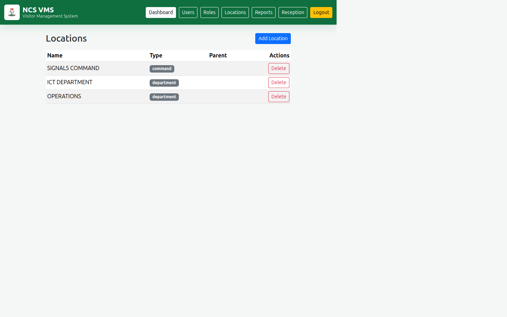

Define the organisational structure — **Departments**, **Commands** and **Units**.
A location may have a parent, so you can build a hierarchy (for example a unit inside
a command). A location with children cannot be deleted until its children are removed.

### 7.5 Reports

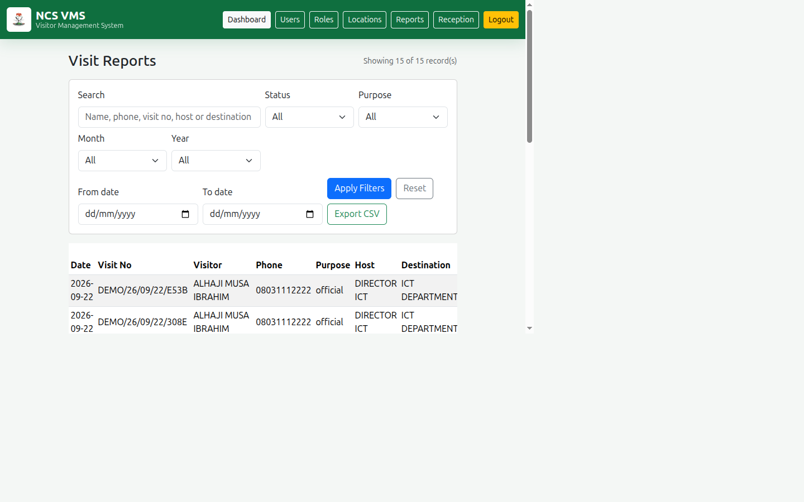

The reports page is the full-visit history with the same powerful filters — search,
status, purpose, month, year and date range — plus **Export CSV**.

Use reports to answer management questions such as *"How many official visitors did we
host in September?"* or *"Who was on site on a particular date?"*

---

## 8. Troubleshooting

| Problem | Cause and solution |
| --- | --- |
| *"Invalid service number or password."* | Check spelling and Caps Lock. If it persists, ask the administrator to reset your password. |
| *"This account has been disabled."* | The administrator has deactivated your account. Contact them to restore access. |
| *"Phone number must contain exactly 11 digits."* | Re-enter the phone number using digits only. |
| Camera shows *"Camera permission is required."* | Allow camera access in your browser, or use phone/email search instead. |
| *"Multiple faces detected."* | Ask others to step out of frame, leaving only the visitor. |
| *"Active visit already open."* | The visitor never signed out. Use **Today's Visits** to sign them out, then create the new visit. |
| *"Access Denied."* | Your role does not permit that page. Ask the administrator. |
| Nothing matches in History. | Clear the filters and click **Apply Filters**, or widen the date range. |

---

## 9. Glossary

| Term | Meaning |
| --- | --- |
| **Visitor** | A person. Registered once and reused for every visit. |
| **Visit** | One entry event by a visitor, with its own reference and status. |
| **Visit No** | The unique reference, e.g. `NCS/26/09/22/0001`. |
| **Sign In / Check In** | Recording a visitor's arrival. |
| **Sign Out** | Recording a visitor's departure, closing the visit. |
| **Status** | `In` (on site) or `Out` (departed). |
| **Role** | A set of permissions that decides a user's landing module. |
| **Officer** | Reception staff role. |
| **Admin** | Administrator role with full access. |
| **Landing Module** | The page a user is taken to after signing in. |
| **Portrait** | The cropped, white-background photograph of a visitor. |

---

*NCS Visitor Management System — User Guide v1.0*